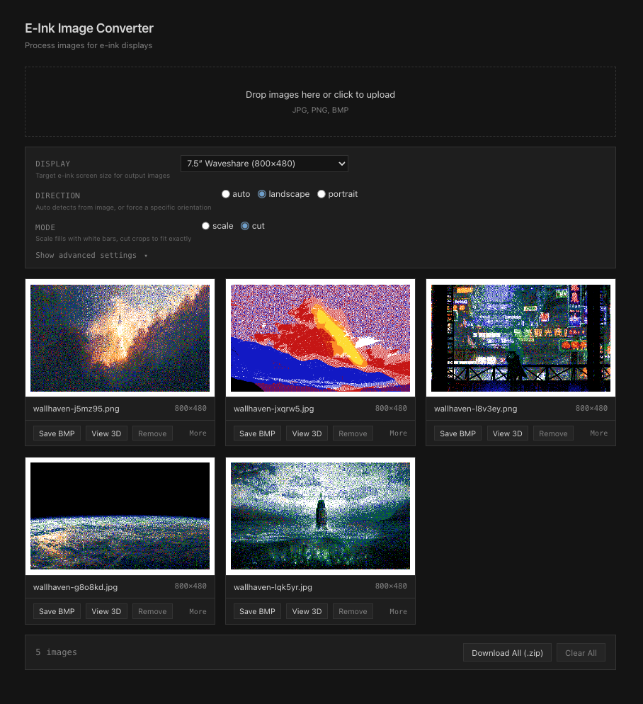
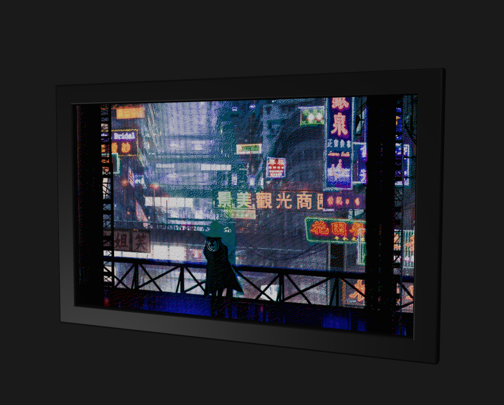

# E-Ink Image Converter

A client-side web app that converts images for e-ink displays. Upload photos, and it will resize, dither, and export them as BMP files ready for your e-ink screen.

Runs entirely in the browser — no server required.





## Features

- **Multiple image upload** — drag-and-drop or file picker (JPG, PNG, BMP)
- **Display presets** — Waveshare, Kindle, reMarkable, or custom dimensions
- **Auto orientation detection** — with manual landscape/portrait override
- **Resize modes** — scale-to-fill with white background, or crop-to-fit
- **Color palettes** — B/W, 4-gray, B/W/Red, B/W/Yellow, 7-color
- **Floyd-Steinberg dithering** — RGB error diffusion for any palette
- **Per-image brightness/contrast** — fine-tune each image individually
- **Before/after comparison** — toggle in fullscreen modal (B key)
- **3D frame viewer** — see your images in a realistic e-ink frame with orbit controls and e-ink refresh animation
- **Drag to reorder** — arrange images before export
- **Filename customization** — pattern with {name}, {n}, {nn} tokens
- **BMP export** — individual or batch zip with fileList.txt and index.txt
- **PWA/offline support** — installable, works without internet
- **Dark theme** — utility-style UI

## Getting Started

```bash
npm install
npm run dev
```

Open `http://localhost:5173` in your browser.

## Build

```bash
npm run build
```

Output goes to `dist/`.

## Tests

```bash
npm test
```

## Stack

- Svelte 5
- Vite
- Three.js (3D frame viewer)
- Vanilla CSS (dark theme)
- Canvas API for image processing
